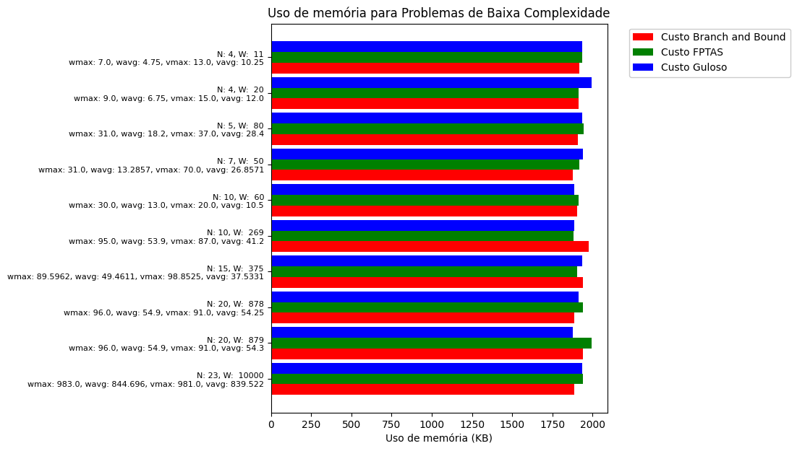
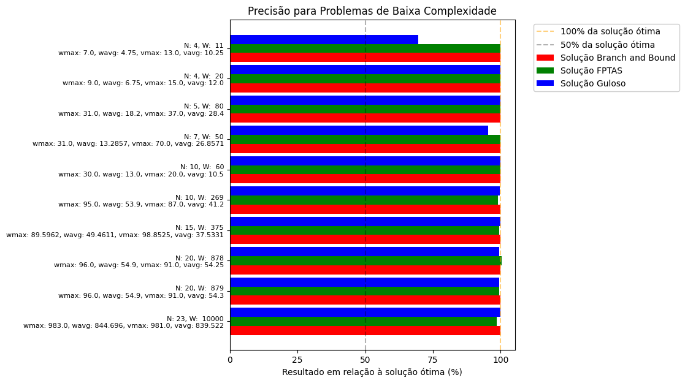
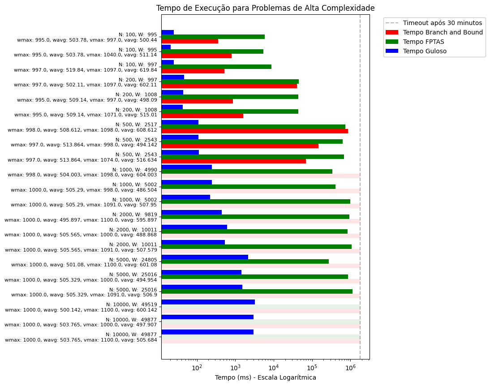

# Trabalho Prático 2 de Algoritmos 2:  Soluções para problemas difíceis

### O que é?
Este repositório contém a implementação de um trabalho prático da disciplina Algoritmos 2 - UFMG que aborda os aspectos práticos de algoritmos exatos e aproximativos para solucionar problemas NP-difíceis. Especificamente, foram, implementadas diferentes abordagens para solucionar o problema da mochila, usando uma técnica branch-and-bound e dois algoritmos 2-aproximativos: um baseado no FPTAS (fully polynomial-time approximation scheme), outro baseado em uma estratégia gulosa. No repositório, há um código que executa os testes para cada algoritmo em diversas instâncias diferentes, assim como exibe seus resultados, organizados em gráficos e em uma tabela. Para ver nossa análise dos resultados, veja a [<u>documentação</u>](documentacao.pdf).

[Versão alternativa da documentação, em LaTeX](https://www.papeeria.com/p/55f1393e392e01fc0413a25bc6e2f4e5#/main.tex)

### Como usar?
Após clonar o repositório, é possível usar o bash para executar comandos make, que manipulam os programas e os testes implementados.

#### Compilando
Para compilar o programa principal, com todos os algoritmos, digite `make` no terminal.
``` bash
make # Compila o programa tp2.exe, no diretório ./bin/
```
#### Executando os testes
A execução dos testes está dividida em 3 comandos diferentes. Primeiramente, existem alguns testes pequenos e rápidos, somente para testar as métricas básicas dos algoritmos:
``` bash
make testslow # Executa a bateria de testes de baixa dimensão, salvando os resultados em './results/low_results.txt'
```
Também, existem testes grandes, usados para ver como os algoritmos se comportam quando escalonados. Estes testes demoram algumas horas para finalizarem, sendo limitados a 30 minutos por cada instância:
``` bash
make testslarge # Executa a bateria de testes de dimensão alta, salvando os resultados em './results/large_results.txt'
```
Porém, a forma mais direta ao ponto de se avaliar os algoritmos é executando todos os testes, com `make tests`, apenas.
``` bash
make tests # Executa ambas as baterias de testes mencionadas.
```
#### Organizando os resultados
Ao executar `make results`, é gerada uma tabela a partir dos arquivos com os resultados das baterias de teste, que organiza todos os resultados em um só lugar. Além disso, são criados [gráficos comparativos](results/images/) para cada uma das métricas avaliadas.

``` bash
make results # Gera a tabela 'resultados_combinados.csv' e os gráficos em 'images/', no diretório './results/'
```
## Nossos resultados:
### [<u>Tabela com todos os resultados</u>](results/resultados_combinados.csv)
Aqui estão exibidos os gráficos comparativos referentes a todos os nossos testes:
### Instâncias pequenas:
#### Tempo: 
#### Memória: 
#### Precisão: 
### Instâncias grandes:
#### Tempo: 
#### Memória: 
#### Precisão:  


